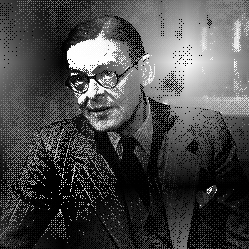

Wow. I just came across this amazing little piece of prose:

> We shall not cease from exploration    
And the end of all our exploring    
Will be to arrive where we started    
And know the place for the first time.

T.S. Eliot — “Little Gidding”

[Read the whole poem](http://www.columbia.edu/itc/history/winter/w3206/edit/tseliotlittlegidding.html)

<small>(the image came from here: http://www.mbird.com/2010/03/ts-eliots-cocktail-party-again/)</small>